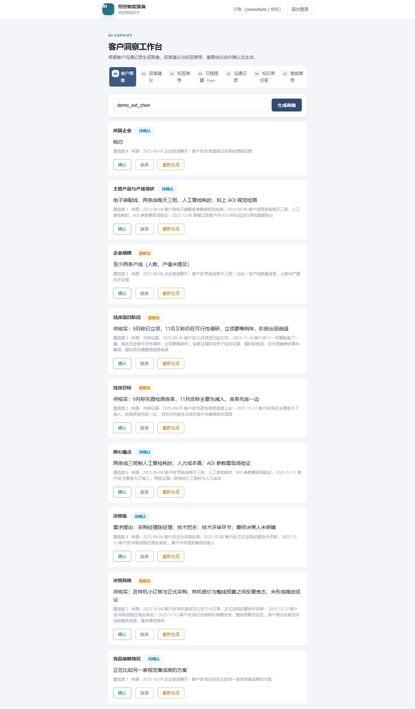
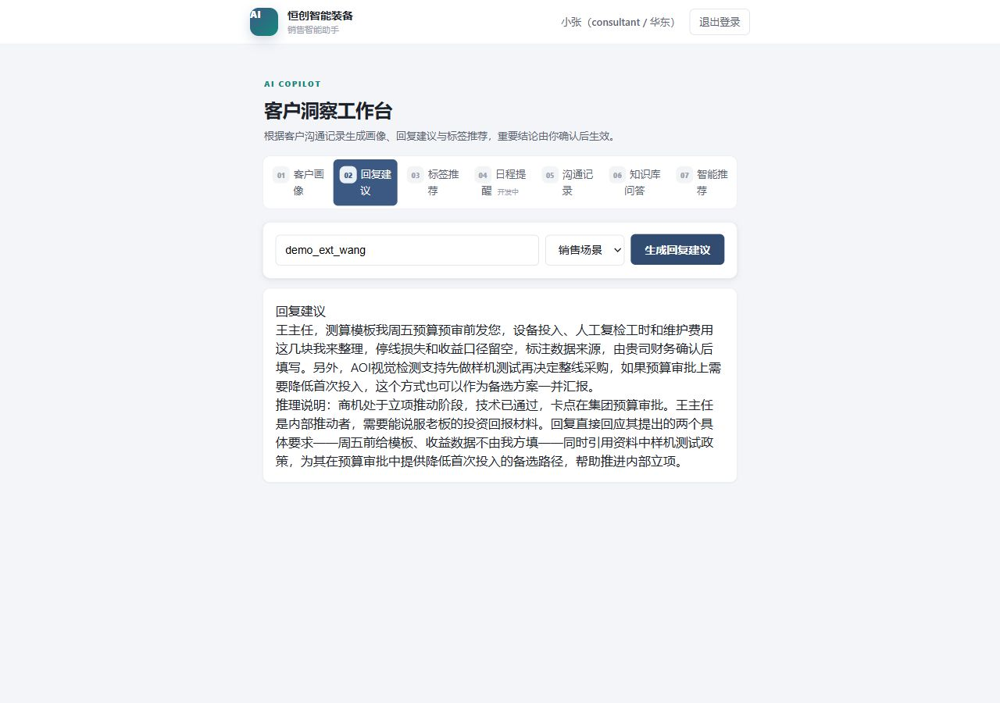
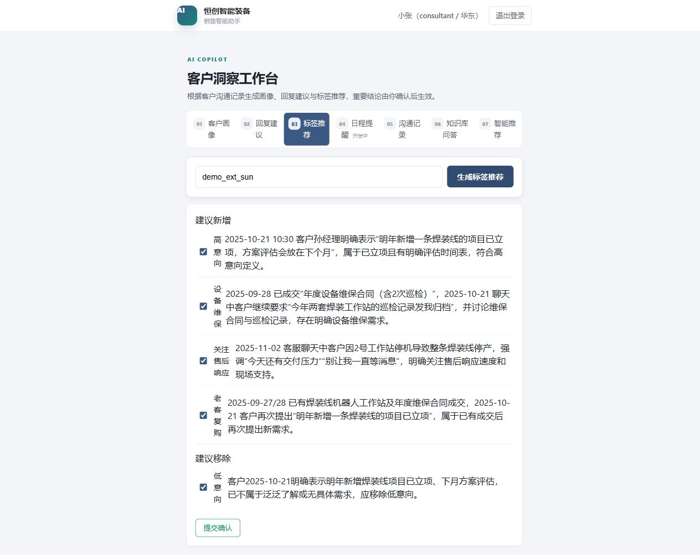
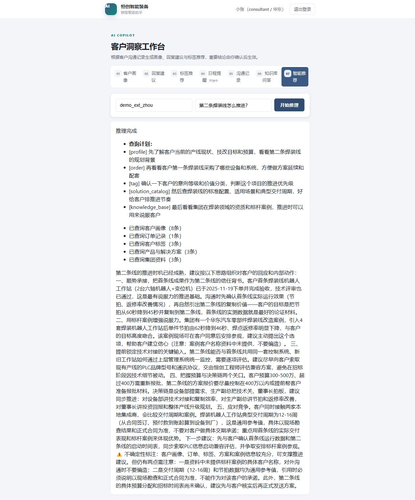
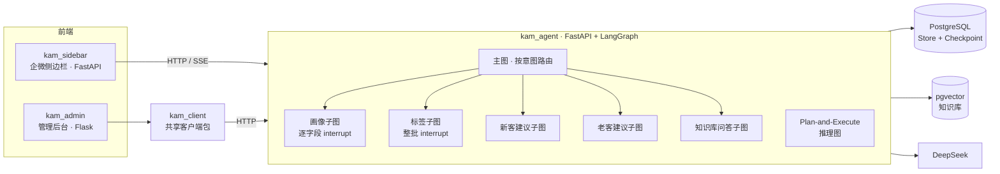

# KAM Copilot · 制造业客户销售辅助系统

> 给工业自动化企业的大客户销售顾问用的 AI 助手：帮顾问"做功课"，不替顾问做决定。
> 客户画像和标签推荐先生成草稿，由顾问确认后才写入正式数据；回复建议只供顾问参考。



## 它解决什么问题

在恒创智能装备集团（**虚构企业**，所有演示数据均为虚构）的场景里，销售顾问依据模拟的企业微信沟通记录跟进制造企业，推动产线技改方案、处理售后维保。常见的问题有这几类：

- 顾问一离职，客户信息就断了
- 客户标签靠顾问各自判断，统计口径对不上
- 新客在谈方案、老客在报修或扩产，需要的信息完全不同
- 客户问到交期、质保这类问题，顾问要翻好几份资料

## 功能

| 编号 | 功能 | 一句话说明 | 是否人工确认 |
| --- | --- | --- | --- |
| F01 | 客户画像 | 从聊天和订单里推断最多 12 个画像字段，每个生成的字段带置信度和证据来源，低置信度的字段标"待核实" | ✅ 逐字段确认 / 放弃 / 重新生成 |
| F02 | 新客方案沟通建议 | 结合画像、聊天、订单和检索到的产品方案资料，识别商机阶段和对方在决策链中的角色 | 参考草稿，顾问决定是否发送 |
| F03 | 老客售后与扩容建议 | 结合客服聊天和订单（交付与维保历史），区分故障报修、维保、投诉、扩容 | 参考草稿 |
| F04 | 标签推荐 | 在 6 组 29 个标签里建议新增 / 移除，单选组由代码兜底互斥 | ✅ 整批勾选确认 |
| F16 | 知识库问答 | pgvector 检索集团资料作答；检索分数低或资料答不上时走固定兜底话术 | — |
| F17 | 综合推理 | Plan-and-Execute：先生成查询计划，再逐步执行，进度通过 SSE 实时推送 | — |

| 回复建议与标签推荐 | 综合推理 |
| --- | --- |
| <br/> |  |

管理后台的[超管看板](docs/screenshots/admin-dashboard.png)展示演示数据；[跨区访问 403](docs/screenshots/admin-forbidden.png)是华南总监直接打开华东客户详情时的页面。

## 架构



- **数据访问收口**：只有 `kam_agent` 连数据库、调大模型；后台和侧边栏都通过 HTTP/SSE 访问。
- **人机协作边界**：画像和标签会改变正式数据，所以必须 `interrupt` 等待确认；回复建议只是给顾问看的参考，不需要中断。
- **权限两个维度**：功能权限用路由装饰器按角色拦截；数据范围按角色 × 大区在应用层过滤（Store 是键值存储，不支持 JOIN）。

## 设计亮点

1. **画像字段级独立任务**：多个字段同时 `interrupt`、其中一个又要求重新生成时，LangGraph 在"多个并发中断 + 动态生成新中断"这种组合下无法正确返回新的中断。改成每个字段用独立的子 `thread_id` 各跑一次子图后，每个执行实例永远只有一个待处理中断。复现脚本见 `kam_agent/experiments/repro_parallel_dynamic_interrupt.py`。
2. **新客 / 老客拆成两个子图**：两者的输入集合不同（新客：画像 + 企微聊天 + 订单 + 产品方案资料；老客：客服聊天 + 订单），合并会让 State 里一半字段常年为空。
3. **置信度规则写进 prompt，校验写进代码**：例如"技改项目阶段"会自然推进也会倒退，只有出现明确推进事件才采信新阶段，阶段倒退一律给低分；标签单选组由 `_enforce_single_select()` 在代码层兜底。
4. **知识库三层把关**：阈值粗筛明显无关的问题 → 模型判断资料能否回答（`answerable`）→ 答不上时由代码输出带客户经理姓名的固定话术。
5. **跨服务批量查询**：看板从逐客户请求改为按数据类型批量请求，跨服务 HTTP 请求从约 36 次降到 4 次；重依赖懒加载使服务冷启动从约 16.8 秒降到约 7.9 秒。

详细设计见 [`设计文档/`](设计文档/)，业务口径见 [`设计文档/12-数据字典.md`](设计文档/12-数据字典.md)。

## 快速开始（Windows · PowerShell）

**前置条件**：Docker Desktop、[uv](https://docs.astral.sh/uv/)、Python 3.12、一个 DeepSeek API Key；本机 5442、5443、8000、5001、8002 端口空闲。首次运行需要联网下载 embedding 模型，耗时较长。Docker Compose 只启动两个数据库，三个 Python 服务由本机启动脚本运行。

```powershell
# 1. 启动两个数据库（业务库 5442、向量库 5443）
docker compose up -d

# 2. 配置环境变量：四个组件各自把 .env.example 复制为 .env
#    需要填写：kam_agent 的 DEEPSEEK_API_KEY；四个组件相同的 INTERNAL_API_KEY（随机长字符串）
#    另为 kam_admin 的 FLASK_SECRET_KEY、kam_sidebar 的 SESSION_SECRET_KEY 各设置随机长字符串
Get-ChildItem -Recurse -Filter .env.example -Depth 1 | ForEach-Object { Copy-Item $_.FullName ($_.FullName -replace '\.example$','') }

# 3. 安装依赖（kam_client 需先于 kam_admin）
foreach ($d in 'kam_client','kam_agent','kam_admin','kam_sidebar') { Push-Location $d; uv sync; Pop-Location }

# 4. 初始化演示数据（标签、员工、客户、知识库）
.\scripts\init_demo_data.ps1

# 5. 一键启动三个服务
.\一键启动.ps1
```

| 服务 | 地址 |
| --- | --- |
| 侧边栏 | http://127.0.0.1:8002/ |
| 管理后台 | http://127.0.0.1:5001/login |
| Agent API 文档 | http://127.0.0.1:8000/docs |

**演示账号**（密码均为 `demo123`，仅限本地演示）：

| 账号 | 角色 | 可见客户 |
| --- | --- | --- |
| `demo_emp_xiaozhang` | 华东顾问（侧边栏演示用） | 8 |
| `demo_emp_xiaolin` / `demo_emp_xiaozhao` | 华南 / 华北顾问 | 4 / 2 |
| `demo_emp_manager` / `demo_emp_manager_south` | 华东 / 华南大区总监 | 8 / 4 |
| `demo_emp_admin` | 超级管理员 | 14 |

**建议演示路径**：侧边栏登录小张 → 选"陈经理"生成画像，看"技改项目阶段"被标为待核实（他 9 月说已立项、11 月又说还在调研）→ 选"王主任"生成回复建议 → 在知识库里问"焊装工作站一般多久交付"。

页面输入的是客户 ID：陈经理 `demo_ext_chen`、王主任 `demo_ext_wang`、孙经理 `demo_ext_sun`、周工 `demo_ext_zhou`。画像是待确认草稿；综合推理要用已确认画像时，先在画像页生成并逐字段核实、确认。首次画像生成会逐字段调用模型，可能需要等待数分钟；首次回复建议会加载本地向量模型，也可能比后续请求慢。

## 测试

```powershell
cd kam_agent; uv run pytest -q   # 37 passed
cd ..\kam_admin; uv run pytest -q # 13 passed
```

## 已知局限与 Roadmap

- **F05 日程提醒**、**F15 企业微信真实集成**：尚未实现（F15 设计稿见 `设计文档/10`）
- F17 直接用客户原话检索产品资料，召回会漏掉相关片段 → 计划加查询改写
- 模型偶发输出非法 JSON：已加一次自动重试，未做结构化输出约束
- 画像目前只支持确认 / 放弃 / 重新生成，不支持顾问直接手工编辑字段值
- 并发一致性靠单进程锁，多实例部署需要换成数据库事务或分布式锁
- 组件间内部调用是 HTTP 明文 + 共享密钥，仅适合本机部署

## 目录结构

```
kam_agent/     LangGraph 核心服务（图、子图、LLM 调用、知识库、Store 访问）
kam_admin/     管理后台（顾问 / 客户 / 商机 / 标签 / 看板 / 资料库）
kam_sidebar/   企业微信侧边栏（SSE 流式交互）
kam_client/    管理后台使用的 Store 客户端包
设计文档/       需求、架构、各组件与功能设计、数据字典
scripts/       演示数据初始化、数据库初始化 SQL
```

## 声明

本项目为个人作品集项目。"恒创智能装备集团"及所有客户、人名、订单、知识库资料均为虚构的演示数据，与任何真实企业无关。
