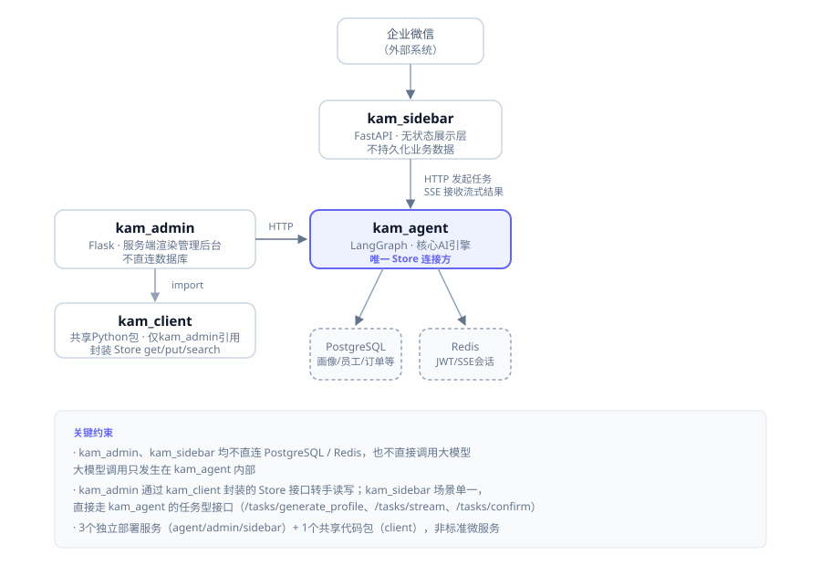
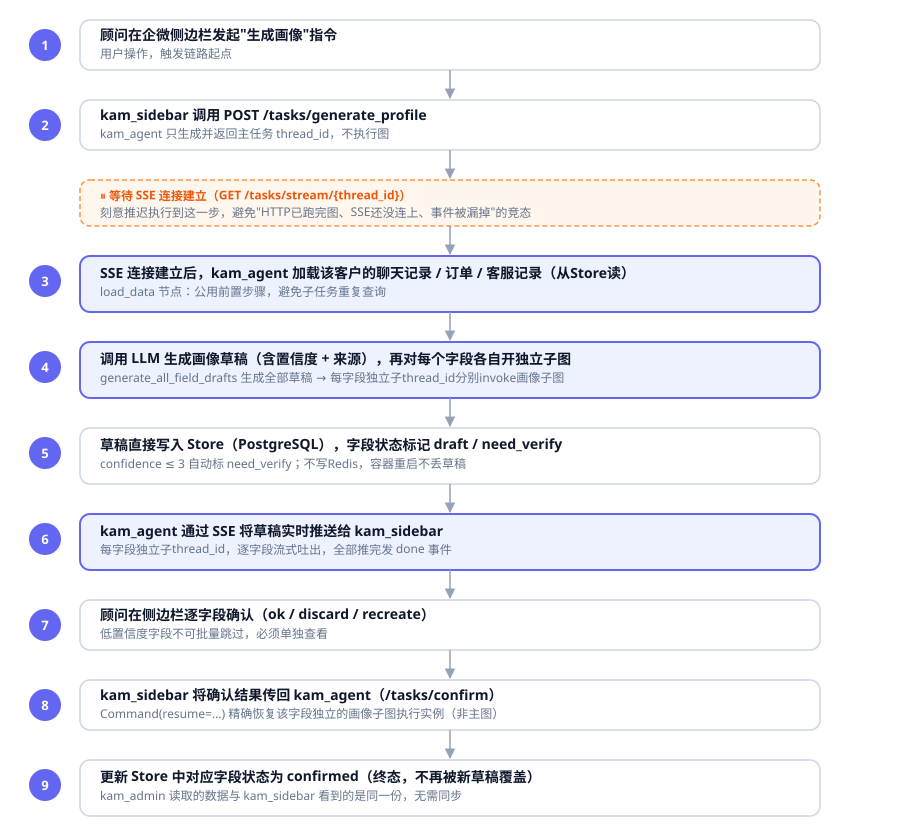
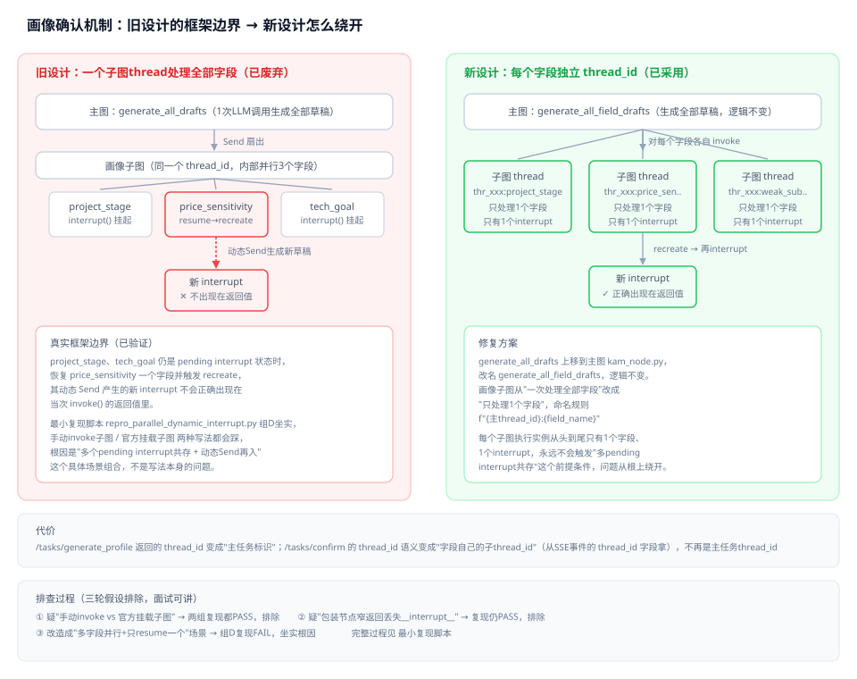

# KAM Copilot — 架构设计文档

> 业务需求见 [01-需求规格说明书.md](01-需求规格说明书.md)，字段和标签见 [12-数据字典.md](12-数据字典.md)。第七章记录 F16/F17 的架构取舍。

---

## 一、整体架构风格

架构决策分为服务拆分和服务内部组织两个层级：

| 层级 | 问题 | 判断结论 |
|---|---|---|
| 宏观：服务拆分粒度 | 项目该拆几个独立部署单元？ | 3个独立服务 + 1个共享代码包，非标准微服务（无服务注册发现/网关/分布式事务） |
| 微观：单服务内部组织 | 每个服务内部代码怎么分层？ | 功能模块化（Feature-First），按业务功能拆文件夹，而非技术层拆 |

**为什么不是标准微服务**：kam_agent/kam_admin/kam_sidebar之间只是简单HTTP+SSE调用，没有服务发现、网关、分布式事务，本质是"单体拆了几个入口"，符合《4-架构思想》里"功能模块化"的适配场景，不落入其明确反对的"标准微服务"范畴。

**为什么内部用功能模块化而非分层架构**：kam_agent的核心工作是多个独立AI子任务（画像生成/回复建议/标签推荐/知识库问答/综合推理），彼此边界清晰、迭代节奏independent，按功能拆文件夹能让改一个子任务不影响其他任务，使各能力的修改范围清晰。

---

## 二、服务边界与依赖图

### 2.1 四个组成部分

| 组成部分 | 类型 | 技术栈 | 职责 |
|---|---|---|---|
| **kam_agent** | 独立部署服务 | LangGraph | 核心AI引擎：画像、回复建议、标签推荐、知识库问答和综合推理；日程提醒尚未实现。**唯一**持有PostgreSQL/Redis连接权限的组件，对外暴露Store API供其他服务转手调用 |
| **kam_admin** | 独立部署服务 | Flask（服务端渲染） | 管理后台：员工/客户/订单/标签管理、数据看板、AI采纳率统计。不直连数据库，通过kam_agent的Store API读写 |
| **kam_sidebar** | 独立部署服务 | FastAPI | 顾问侧边栏：展示与交互层，不持久化任何业务数据，通过HTTP发起任务、SSE接收流式结果 |
| **kam_client** | 共享Python包（非独立进程） | Python库 | 封装Store底层API（get/put/search）调用细节，仅被kam_admin引用，用于多表聚合查询（如客户详情页联合查画像+订单+标签）（对应设计模式中的适配器/门面模式）。kam_sidebar场景单一（发起任务/展示/确认），走kam_agent的任务型接口，不需要此包 |

### 2.2 依赖关系图

```
                    ┌─────────────┐
                    │  企业微信    │ (外部)
                    └──────┬──────┘
                           │
                    ┌──────▼──────┐
                    │ kam_sidebar │  FastAPI，SSE推送，无状态展示层
                    └──────┬──────┘
                           │ HTTP（发起任务/确认） + SSE（接收流式结果）
                           │
┌──────────────┐    ┌──────▼──────┐
│  kam_admin    │───▶│  kam_agent  │  LangGraph，唯一Store连接方
│ (Flask管理后台) │HTTP│ (核心AI引擎) │
└──────┬────────┘    └──────┬──────┘
       │                    │
       │ import             ├── PostgreSQL（持久化：画像/员工/客户/标签/订单/消息）
       ▼                    └── Redis（会话缓存：JWT、SSE连接状态）
┌──────────────┐
│  kam_client   │  共享Python包，仅kam_admin引用
│ (Store API封装)│
└──────────────┘
```

**关键约束**：kam_admin、kam_sidebar均不直连PostgreSQL/Redis，也不直接调用大模型；大模型调用只发生在kam_agent内部。kam_admin通过kam_client封装的Store底层接口（get/put/search）转手读写数据；kam_sidebar不需要kam_client，它跟kam_agent之间走的是任务型接口（发起任务/接收流式结果/提交确认，见5.1节`/tasks/*`），不直接操作Store原始读写接口——sidebar的场景单一（发起、展示、确认），用不上kam_client封装的底层调用能力，那是kam_admin做多表聚合查询（如客户详情页同时查画像+订单+标签）时才需要的。

**可视化版本**（同上文字内容，配图便于速览）：



---

## 三、数据流示例（以画像生成为主链路）

>  更新：本节文字此前停留在架构设计初期版本（"加载数据+调LLM"写成发起请求时一步到位、未提子thread_id机制、确认动作的resume目标写的是主图），recreate多pending interrupt框架边界修复（见`实战记录.md`当天条目）后代码结构已变化，配图`图/02-画像生成数据流图.svg`当时已跟进更新，但这段文字一直没有同步回填，此次一并订正，文字与配图、代码三者对齐。

1. 顾问在企微侧边栏发起"生成画像"指令
2. kam_sidebar调用`POST /tasks/generate_profile`，kam_agent**只生成并返回一个主任务`thread_id`，不执行图**——真正的执行被推迟到SSE连接建立之后，从根上避免"HTTP已跑完图、SSE还没连上、事件被漏掉"的竞态（见`webapp.py`文件头部执行时序说明）
3. kam_sidebar用拿到的`thread_id`连接`GET /tasks/stream/{thread_id}`（SSE），**连接真正建立后**，kam_agent才触发`graph.invoke()`：先由`load_data`节点加载该客户的聊天记录/订单/客服记录（从Store读），再由`generate_all_field_drafts`一次性调用LLM生成全部字段的画像草稿（含置信度+来源）
4. `call_profile_subgraph`节点对每个字段各自发起一次**独立子`thread_id`**（命名规则`f"{主thread_id}:{字段名}"`）的画像子图`invoke()`；子图内部把草稿**直接写入Store（PostgreSQL）**，标记字段状态为`draft`或`need_verify`，随即在`confirm_one_field`处`interrupt()`冻结等待
5. kam_agent将每个字段的中断信息（含各自的子`thread_id`与`interrupt_id`）通过SSE逐条实时推送给kam_sidebar，全部字段推送完毕后发送`done`事件
6. 顾问在侧边栏逐字段确认（ok / discard / recreate）
7. kam_sidebar调用`POST /tasks/confirm`，将确认结果连同该字段自己的子`thread_id`、`interrupt_id`一并传回kam_agent——**resume的目标是这个字段独立的画像子图执行实例，不是主图**（每个字段各自独立子图后，中断已经不会冒泡到主图层）
8. 画像子图收到`Command(resume={interrupt_id: action})`后更新Store中对应字段状态为`confirmed`或`discarded`（已确认字段不再被后续新草稿覆盖）；若为`recreate`，子图重新调用LLM生成新草稿并再次`interrupt()`，新草稿直接在这次`/tasks/confirm`的响应体里带回，不依赖前端重新连SSE
9. kam_admin通过Store API读取的数据，与kam_sidebar看到的是同一份数据，无需数据同步

**草稿态与已确认态的关系**：不是两份数据，而是同一条画像记录内，每个字段各自带一个状态标记（`draft`/`need_verify`/`confirmed`/`discarded`），统一持久化在PostgreSQL中——不使用Redis存草稿，避免因服务重启导致草稿丢失（对应01号文档验收标准6.2"容器重启后数据不丢失"）。Redis仅承担会话/缓存类职责（JWT Token、SSE连接状态）。

**为什么每个字段各自独立thread_id（而非一个主任务thread_id处理全部字段）**：这是recreate分支排查出的真实LangGraph框架边界的修复方案——多个字段的中断同时pending在同一个子图执行实例里时，恢复其中一个、该分支动态产生的新中断不会正确出现在返回值里。改成"每个字段各自独立子图执行实例、永远只有1个中断"后，这个触发条件不再成立，问题从根上解决。完整排查过程见`实战记录.md` 条目。

**可视化版本**（9个步骤逐条图示）：



---

## 四、LangGraph Store 数据设计

### 4.1 核心表：`external_user_profile`（客户画像）

对应01号需求文档3.1节的置信度机制与逐字段确认交互。

```
namespace: ("external_user_profile", follow_user_id)   # 按跟进顾问分组
key: external_id                                        # 客户ID
value: {
  "profile_items": {
    "company_name": {"value": "苏州联拓汽车零部件有限公司", "confidence": 8, "source": "msg_20260805_001", "status": "confirmed"},
    "production_status": {"value": "3 条半自动焊装线", "confidence": 8, "source": "msg_20260805_001", "status": "draft"},
    "budget_range": {"value": "300–500 万", "confidence": 6, "source": "msg_20260803_014", "status": "need_verify"},
    "project_stage": {"value": "技改项目阶段待核实", "confidence": 3, "source": "msg_20260801_002", "status": "need_verify"},
    "tech_goal": {"value": "提升焊接一致性", "confidence": 7, "source": "msg_20260710", "status": "draft"},
    "reply_time":    {"value": "工作日上午", "confidence": 5, "source": "msg_history", "status": "draft"}
  },
  "timeline": [
    {"time": "", "event": "首次咨询", "source": "msg_xxx"}
  ],
  "updated_at": "T10:00:00Z"
}
```

设计要点：
- 每个可推断字段是独立的三元组对象（值/置信度/来源），跟随字段级`status`
- `confidence ≤ 3` 自动标记 `status: need_verify`（对应01号文档"低置信度字段不允许批量跳过"）
- 跟进历史（`timeline`）为客观记录，无置信度字段
- kam_agent写入新草稿时，只更新非`confirmed`状态的字段，跳过已确认字段（保证"已确认不被新消息覆盖"）

### 4.2 核心表：`employee`（员工，落地两维度权限模型）

```
namespace: ("employee",)
key: user_id
value: {
  "user_id": "u001",
  "name": "小张",
  "role": "consultant",        # consultant / regional_manager / super_admin —— 对应功能模块权限
  "region": "华东"              # 数据范围权限过滤依据（区域主管用此字段限定可见范围）
}
```

`role`决定能进入哪些管理后台页面，`region`决定同一页面内能看到哪些数据，两个维度独立组合（对应01号文档3.5节权限模型）。

### 4.3 其余命名空间

`external_user` 保存客户基础信息与标签；`tags_setting` 保存六组 29 个标签定义；`wxqy_msg` 与 `wxkf_msg` 分别保存企微、客服会话；`wxxd_order` 保存订单；`system_config` 保存全局关停开关。资料库片段位于独立向量库。`external_user_profile` 按字段保存值、置信度、来源和状态，逐字段确认依赖这一结构；若只保留扁平的字段值，会失去草稿态和证据链。

`follow_user_id` 用于按顾问分组；管理后台仍须按角色和区域做应用层过滤，命名空间分组不能代替 HTTP 权限检查。

---

## 五、接口清单

### 5.1 kam_agent 对外接口

| 接口 | 方法 | 用途 | 调用方 |
|---|---|---|---|
| `/store/get` | POST | 读取指定namespace+key数据 | kam_admin（经kam_client） |
| `/store/put` | POST | 写入/更新数据 | kam_client内部封装 |
| `/store/search` | POST | 按namespace前缀批量查询 | kam_admin（如按顾问查客户列表） |
| `/tasks/generate_profile` | POST | 触发画像生成任务 | kam_sidebar |
| `/tasks/stream/{thread_id}` | GET（SSE） | 订阅任务执行流式结果 | kam_sidebar |
| `/tasks/confirm` | POST | 顾问确认/拒绝单个字段建议 | kam_sidebar |
| `/auth/token` | POST | 用户名密码换Token | kam_admin, kam_sidebar |

#### 5.1.1 `/tasks/generate_profile` 请求/响应

请求体：
```json
{
  "follow_user_id": "u001",       // 发起请求的顾问ID
  "external_id": "ext_8891"       // 目标客户ID
}
```
响应体：
```json
{
  "thread_id": "thr_xxxxx"        // 本次任务的主线程ID，前端凭此订阅SSE
}
```

** 说明**：这个`thread_id`是"主任务"标识，不是每个字段确认时`/tasks/confirm`要用的那个——`/tasks/confirm`要用的是各字段自己的子`thread_id`，从SSE事件里的`thread_id`字段拿，见5.1.2/5.1.3节的架构变更说明。

#### 5.1.2 `/tasks/stream/{thread_id}` SSE事件格式

每个事件为一个字段级更新，逐字段流式吐出（而非等全部生成完再一次性返回）：
```json
event: profile_field_update
data: {
  "field": "project_stage",
  "value": "已立项，预计下季度招标",
  "confidence": 8,
  "source": "msg_20260805_001",
  "status": "draft",
  "interrupt_id": "irq_xxxxx",     // 精确恢复凭据，见下方说明
  "thread_id": "thr_xxxxx:project_stage"   // 新增：这个字段自己的子thread_id，
                                    // /tasks/confirm 必填字段要传这个，不是主thread_id
}
```
全部字段生成完毕后发送结束事件：
```json
event: done
data: {"thread_id": "thr_xxxxx"}
```

** 架构变更：逐字段独立`thread_id`（重要，取代此前"Send并行扇出+共享一个thread"的设计）**

背景：此前的设计是`generate_all_drafts`一次性生成全部字段草稿，`dispatch_fields_for_confirm`用`Send`把草稿拆成多个并行分支，全部字段共享同一个主`thread_id`、各自独立的`interrupt_id`。这个设计在真实开发`recreate`分支时暴露出一个LangGraph框架边界：**当一个子图执行实例里同时存在多个pending interrupt时，恢复其中一个分支、该分支又动态`Send`产生新的interrupt，这个新interrupt不会正确出现在当次`invoke()`的返回值里**（用最小复现脚本`kam_agent/experiments/repro_parallel_dynamic_interrupt.py`组D真实坐实，且验证了"手动invoke子图"和"官方挂载子图"两种写法都会踩这个问题，不是写法本身的问题，是这个具体场景组合下LangGraph的行为边界）。

排查过程完整记录见`实战记录.md`当天条目，简要过程：①怀疑"手动invoke vs 官方挂载子图"→ 两组最小复现都PASS，排除；②怀疑"包装节点窄返回丢失`__interrupt__`信息"→ 加一组复现仍PASS，排除；③改造成"多字段并行+只resume一个"场景 → 组D复现FAIL，坐实根因。

修复方案：**`generate_all_drafts`上移到主图`kam_node.py`（改名`generate_all_field_drafts`，逻辑不变，仍是一次LLM调用生成全部字段草稿，不影响效率）；画像子图不再一次处理全部字段，改成只处理一个字段——主图对每个字段各自发起一次独立`thread_id`的子图`invoke()`（命名规则`f"{主thread_id}:{field_name}"`）**。这样每个子图执行实例从头到尾只有1个字段、只有1个interrupt，永远不会触发"多pending interrupt共存"这个前提条件，`recreate`分支内部"重新生成→再interrupt"的`Command(goto=Send(...))`循环逻辑不用改，问题从根上被绕开。

代价：`/tasks/generate_profile`返回的`thread_id`现在只是"主任务标识"，SSE端点内部循环对每个字段各自invoke独立子thread、把每个字段的interrupt收集起来一次性推送；`/tasks/confirm`的`thread_id`字段语义变成"这个字段自己的子thread_id"，不再是主任务的thread_id（见5.1.3节）。

`interrupt_id`本身的机制说明（沿用此前验证结论，未变）：这个ID由LangGraph运行时生成、前端无法自己构造，SSE推送草稿时一并透传给前端，前端确认时原样带回，是`/tasks/confirm`精确恢复对应字段的唯一凭据。

**可视化版本**（旧设计框架边界 vs 新设计修复方案对比，含排查过程时间线）：



#### 5.1.3 `/tasks/confirm` 请求/响应

**设计原则**：单字段接口，一次确认一次请求。低置信度字段"不允许批量跳过"这条规则不在接口层做特殊校验，由前端UI强制逐个展示确认，接口只需老实处理好"确认/丢弃/重新生成"单个字段的语义。

** 语义变更（配合5.1.2节的逐字段独立thread架构）**：`thread_id`字段不再是主任务的thread_id，而是这个字段自己的子`thread_id`（格式`f"{主thread_id}:{field_name}"`，来自SSE事件里的`thread_id`字段）。后端`resume`的目标也从"主图"改成"画像子图"——因为现在每个字段各自是独立的子图执行实例，`Command(resume=...)`必须配合正确的子`thread_id`才能定位到具体是哪个字段在等待恢复；主图在生成阶段已经把所有字段的interrupt消化处理完，不会再有内容等主图去resume。

请求体：
```json
{
  "thread_id": "thr_xxxxx:project_stage", // 必填，这个字段自己的子thread_id，来自SSE事件的thread_id字段
  "follow_user_id": "u001",
  "external_id": "ext_8891",
  "field": "project_stage",               // 目标字段名，仅用于后端二次校验
  "interrupt_id": "irq_xxxxx",    // 精确恢复凭据，必填，来自SSE事件透传
  "action": "ok"                  // ok / discard / recreate 三选一（对应01号文档确认交互）
}
```
- 后端收到请求后对**画像子图**执行：`profile_graph.invoke(Command(resume={interrupt_id: action}), config={"configurable": {"thread_id": thread_id}})`（`thread_id`是字段自己的子thread，不是主图的）
- `action: "ok"` → 该字段`status`置为`confirmed`，写回Store，响应体只含`status`
- `action: "discard"` → 该字段建议被丢弃，`value`置空，`status`置为`discarded`（独立终态，与`recreate`区分，见`kam_models.py`的`FieldStatus`扩展说明），写回Store，响应体只含`status`
- `action: "recreate"` → 子图内部走`Command(goto=Send("regenerate_one_field", ...))`，重新调用LLM生成这个字段的新草稿，再次`interrupt()`冻结（不写Store、不产生终态）。这次`invoke()`返回值里的`__interrupt__`就是新草稿（因为这个子图执行实例只有这一个字段，不会撞上5.1.2节说明的框架边界），**直接在`/tasks/confirm`的响应体里带回新草稿**，不需要前端重新监听SSE（SSE只负责首次`generate_profile`后的推送）

响应体：
```json
{
  "success": true,
  "field": "project_stage",
  "status": "confirmed",           // ok/discard是终态；recreate时固定是"draft"（新草稿待确认，不是终态）
  "new_interrupt_id": null,        // recreate专属，ok/discard固定为null
  "new_value": null,
  "new_confidence": null,
  "new_source": null
}
```
`recreate`场景下响应体示例：
```json
{
  "success": true,
  "field": "price_sensitivity",
  "status": "draft",
  "new_interrupt_id": "irq_yyyyy",
  "new_value": "高",
  "new_confidence": 7,
  "new_source": "..."
}
```

批量确认高置信度字段（01号文档3.1节"高置信度字段可支持批量确认"）：由**前端循环调用**本接口多次实现，接口本身不提供批量端点，保持单一职责。

**"部分批量、部分强制单独"如何落地**：01号文档"低置信度字段不允许批量跳过"是UI交互层面的约束（不能让顾问在没看内容的情况下被批量按钮带过），不是接口层面需要拒绝的请求类型。对`/tasks/confirm`接口而言，批量确认和单独确认发起的请求结构完全一致（都是单字段`{field, action}`），接口不需要区分"这是批量的一部分还是单独调用"。区分逻辑在前端：批量确认按钮触发时，前端只把`confidence > 3`的字段纳入本次批量候选、循环调用本接口；`confidence ≤ 3`的字段不出现在批量候选列表里，只提供"查看详情并单独确认"的入口。接口保持单一职责（一次确认一个字段），业务规则（谁能批量、谁必须单独）完全交给前端根据字段的`confidence`值判断。

### 5.2 kam_admin 对外接口

沿用01号需求文档3.5节功能模块清单，展开为具体路由表：

| 功能 | 路由 | 方法 | 用途 |
|---|---|---|---|
| 员工管理 | `/api/employees` | GET | 员工列表（含role/region） |
| | `/api/employees` | POST | 新增员工 |
| 客户管理 | `/api/customers` | GET | 客户列表（按`role`+`region`过滤，见4.2节权限模型） |
| | `/api/customers/<external_id>` | GET | 客户详情（联合查画像+标签+基础信息，走kam_client聚合） |
| 订单管理 | `/api/orders/<union_id>` | GET | 客户订单历史 |
| 标签管理 | `/api/tags` | GET | 标签体系（按分类分组展示） |
| | `/api/tags` | POST | 新增/编辑标签定义及关联SOP |
| | `/api/tags/suggestions/<external_id>` | GET | 展示kam_agent生成的标签推荐结果（推荐逻辑由kam_agent产出，admin只读取展示） |
| 数据看板 | `/api/dashboard` | GET | 转化漏斗/续费率/人效分析（按数据范围权限过滤） |
| AI采纳率统计 | `/api/ai_adoption_rate` | GET | 画像字段采纳率；其他维度暂不统计 |
| 登录认证 | `/login` | GET/POST | Session登录 |

统一响应格式：`{"success": true/false, "data": ..., "error": ...}`。

### 5.3 kam_sidebar 对外接口

| 接口 | 方法 | 用途 |
|---|---|---|
| `/api/login` | POST | 顾问登录换JWT |
| `/api/message` | POST | 顾问发起指令 |
| `/api/stream/{thread_id}` | GET（SSE） | 订阅画像生成实时展示 |
| `/api/confirm` | POST | 顾问逐字段确认（透传给kam_agent的`/tasks/confirm`） |
| `/api/health` | GET | 健康检查 |

约束：非AI接口响应 ≤200ms（对应01号文档非功能需求）；AI推理类接口走SSE异步推送，不受此约束。

---

## 六、与01号需求文档的对照检查

| 01号文档要求 | 本文档落地位置 |
|---|---|
| 置信度三元组（值+置信度+来源） | 4.1节 `profile_items` 字段结构 |
| 低置信度需核实、不可批量跳过 | 4.1节 `status: need_verify` 自动标记规则 |
| 已确认字段不被新消息覆盖 | 三、数据流步骤8 + 4.1节写入规则 |
| 两维度权限模型（功能模块+数据范围） | 4.2节 `role` + `region` 字段 |
| SSE流式推送 ≤200ms | 5.3节接口约束 |
| 容器重启数据不丢失 | 三、草稿态与已确认态说明（不用Redis存草稿） |
| AI辅助人工决策（草稿态需确认） | 4.1节字段级status机制贯穿全链路 |

---

## 七、二期架构设计：F16知识库问答 + F17跨模块综合推理

> 对应01号需求文档3.7节。本章记录 F16/F17 的实现边界、Plan-and-Execute 取舍和资料库检索约束。

### 7.1 归属组件与服务边界变化

F16、F17均属于"AI能力"范畴，遵循一期已确立的核心架构约束——**大模型调用只发生在kam_agent内部**，两者都新增在`kam_agent`里，不新建独立服务，不改变一期"3个独立服务+1共享包"的宏观拆分结论：

| 能力 | 归属组件 | 触发方式 | 是否新增组件间接口 |
|---|---|---|---|
| F16知识库问答 | `kam_agent`（新增RAG子图`kam_sub_graph_kb/`） | 与F02/F03一致，走`kam_sidebar`任务型接口，同步返回 | 复用`kam_sidebar`现有的任务发起/接收模式，无需新接口类型 |
| F17跨模块综合推理 | `kam_agent`（新增Plan-and-Execute子图`kam_sub_graph_reasoning/`） | 同上 | 同上，但内部需要调用F16的RAG检索能力和一期已有的画像/订单/标签查询逻辑（组件内部函数调用，非跨服务HTTP） |
| 资料库管理入口 | `kam_admin`（新增路由） | 运营人员上传/替换 | 新增`kam_admin → kam_agent`的资料库写入接口（见7.4节） |
| 全局关停开关 | `kam_admin`（存储+页面）+ `kam_agent`（读取+生效） | 超管操作 | 新增开关状态查询接口（见7.5节） |

**为什么F17内部调用F16而不是让顾问端分别调用两个能力**：F17的五个信息入口本身就包含"知识库"这一项（01号文档3.7.2节表格），F17子图执行"查知识库"这一步时，直接复用F16已经搭好的RAG检索函数即可，这是组件内部的函数级复用，不产生新的跨服务依赖，符合一期"Store连接权限收口到kam_agent一家"的既有原则延伸——现在延伸为"AI能力的内部依赖也收口在kam_agent一个组件内"。

### 7.2 F17核心设计：Plan-and-Execute LangGraph子图结构

**范式选型结论**（已在01号文档3.7.2节确认，此处落地为具体节点设计）：Plan-and-Execute，且**不加执行中重新规划分支**——计划一旦生成，按顺序固定执行完，不支持中途因某一步结果而重新调整后续计划。

**选型依据回顾**：
1. 五个信息入口边界清楚，不存在"查完A才知道要不要查B"的强动态依赖，不需要ReAct那种走一步看一步的灵活性。
2. 需求方明确要求"步骤透明""步数上限"是验收硬指标，固定计划天然满足步数可预测；若加重新规划分支，还需额外设计"重新规划次数上限"，变相引入新的失控风险。
3. 这是kam_agent第一次实现Plan-and-Execute范式（一期F01/F04/F02/F03都是固定字段流程的子图，没有"AI自主生成执行计划"这个环节），没必要在验证新范式本身是否可靠之前，叠加"重新规划"这个新的复杂度维度——万一出问题，无法区分是Plan-and-Execute本身的坑还是重新规划分支引入的坑，参考一期F01踩过的"多pending interrupt+动态分支组合"框架边界教训（`实战记录.md`条目），新范式叠加新分支的组合最容易出未知问题。
4. 对应01号文档的兜底逻辑——计划基于错误假设导致后续步骤白跑时，靠"不确定性标注"这道防线兜底（结论标注"基于部分信息推断，建议核实"），而非靠AI中途自我纠正。这个代价是主动接受的，不是设计疏漏，如果灰度阶段发现"计划经常离谱、顾问吐槽AI死板"，属于可后置的二期内迭代项，不阻塞MVP先跑通。

**子图State设计**：

```python
class ReasoningState(TypedDict):
    # 输入
    follow_user_id: str
    external_id: str
    question: str                    # 客户原始问题

    # 计划阶段产出（一次性生成，不再变更）
    plan: list[PlanStep]             # 计划生成后固定，不支持重新规划

    # 执行阶段产出（逐步累加）
    step_results: list[StepResult]   # 每执行完一步，追加一条结果
    current_step_index: int          # 当前执行到第几步（对应"步数上限"检查点）

    # 综合阶段产出
    final_suggestion: str | None
    confidence_note: str | None      # 不确定性标注，信息不全时必填

class PlanStep(TypedDict):
    step_index: int
    tool: Literal["knowledge_base", "profile", "order", "tag", "solution_catalog"]  # 对应五个信息入口
    reason: str                      # AI为什么要查这一步（供侧边栏透明展示）

class StepResult(TypedDict):
    step_index: int
    tool: str
    raw_result: dict
    display_text: str                # 侧边栏展示的一行提示，如"正在查询客户画像..."已完成后变为"已查询客户画像"
```

**节点结构**（三段式，对应"计划生成→逐项执行→综合"）：

```
generate_plan (LLM一次调用，产出plan，写入State后不再修改)
    │
    ▼
execute_step (循环节点，每次处理plan[current_step_index]一项)
    │  └─ 每步执行后，通过custom stream_mode向侧边栏推送display_text（对应"步骤透明"约束）
    │  └─ current_step_index达到len(plan)时退出循环（步数上限=计划长度，天然满足，不需要额外计数器）
    ▼
synthesize (LLM综合调用，整合全部step_results生成final_suggestion，
            信息不全或某步结果薄弱时必须填写confidence_note)
    │
    ▼
task_result（同步返回，无interrupt——与F02/F03一致，综合推理建议本身不需要逐项人工确认，
             只需顾问确认"是否采纳整段建议并发送"，这个确认动作在侧边栏UI层完成，不是LangGraph interrupt语义）
```

**与一期F01/F04的关键区别**：F01/F04都在"确认"这个动作上用`interrupt()`冻结等待人工输入，因为AI产出需要逐项/整批人工确认才能写入Store生效；F17的产出是一段"建议文本"，本身不写入任何业务数据（不像画像/标签会改变Store里的客户数据），顾问的"发送"动作是在企微里发消息，不是在系统内确认写库，所以F17不需要`interrupt()`，走的是F02/F03那种"同步返回、无需LangGraph层面暂停"的模式。**这个判断很重要**：不要因为"综合推理更复杂"就下意识觉得它也需要interrupt，要看"AI产出是否需要写回系统数据"这个本质问题，F17和F02/F03一样，答案是否。

### 7.3 F16知识库RAG设计要点

F16 以资料片段检索和模型逐条甄别组成两道判断：

- **向量库选型**：独立 PostgreSQL/pgvector 库保存资料片段，由 `kam_agent` 访问；业务 Store 与向量库分开，资料规模较小，暂不引入另一种向量数据库。
- **资料分类与摄入**：`profile` 集团概况、`solution` 产品与解决方案、`honor` 荣誉资质、`faq` 常见问题；演示资料由 `kam_agent/kb_ingest_demo_content.py` 摄入。
- **兜底判定**：`KB_HIT_THRESHOLD=0.4` 负责粗筛，相关与不相关问题的分数存在交叉，单一阈值无法分净。过阈值后由模型返回 `answerable`；为 false 时由代码输出带顾问姓名的固定兜底。维持宽松阈值可减少漏掉相关资料的风险，代价是增加模型甄别负担，且仍需用更大的标注样本评估效果。

### 7.4 资料库管理接口（新增）

| 接口 | 方法 | 用途 | 调用方 |
|---|---|---|---|
| `/kb/documents` | POST | 上传/替换指定类别资料文档，触发重新切分+向量化（本节最初设计时命名为`/kb/upload`，实现时统一成RESTful的资源路径风格，未回填过，订正） | kam_admin |
| `/kb/documents` | GET | 查看当前资料库各类别文档列表及更新时间（不含具体内容，最初设计时命名为`/kb/list`，同上订正） | kam_admin |
| `/kb/documents/{source_doc}` | GET | 查看单份文档的完整内容（新增，`kam_admin`"查看"功能用；跟上一行的区别是这个按`source_doc`查单文档、返回拼接后的原文，不是跨文档的分组统计） | kam_admin |

`kam_admin`不直接操作向量库（遵循一期"不直连数据库"约束），上传的文件通过HTTP传给`kam_agent`，由`kam_agent`完成切分、向量化、写入pgvector的全部处理。

### 7.5 全局关停开关设计

**存储位置**：新增Store命名空间`("system_config",)`，键`reasoning_enabled`，值为布尔型，默认`true`。选择放进现有Store而非新建配置表，理由与一期"数据访问收口kam_agent一家"一致——不为一个开关字段单独引入新的存储机制。

**检查点**：F17 请求入口读取该配置；为 `false` 时跳过 Plan-and-Execute，直接调用 F16 知识库问答路径。

**验收要求（对应01号文档3.7.2节CTO验收点）**：不能只测"开关状态能否正确写入/读取"，必须端到端验证——开关设为`false`后，真实发起一次组合型问题请求，确认返回的确实是简化模式的回复而非综合推理建议。这是一期"端到端联调不能被设计阶段严密性替代"这条方法论教训（`02-项目复盘.md`方法论收获3）在二期的直接应用。

### 7.6 与01号需求文档3.7节的对照检查

| 01号文档3.7节要求 | 本章落地位置 |
|---|---|
| Plan-and-Execute范式，不加重新规划分支 | 7.2节State设计+节点结构 |
| 五个信息入口 | 7.2节`PlanStep.tool`枚举 + 7.1节F17内部复用F16 |
| 步骤透明展示 | 7.2节`execute_step`节点通过custom stream_mode推送`display_text` |
| 步数上限 | 7.2节：计划长度天然是上限，不需要额外计数器（因为不支持重新规划，步数在生成计划那一刻就已固定） |
| 不确定性标注 | 7.2节`synthesize`节点`confidence_note`字段 |
| 人工确认兜底 | 7.2节：确认动作在侧边栏UI层（"是否发送"），非LangGraph interrupt |
| 全局关停开关秒级生效+验证回退 | 7.5节存储设计+验收要求 |
| 知识库兜底话术嵌入顾问姓名 | 7.3节兜底判定（具体话术模板留待开发阶段，非架构层判断） |

---

## 实现状态

F16 与 F17 已有代码实现。F17 通过先创建任务号、再建立 SSE 连接的两段式接口推送步骤；F16 和资料库管理接口已接入 `kam_agent` 与 `kam_admin`。实际可用性、耗时和检索质量以端到端验收记录为准。
